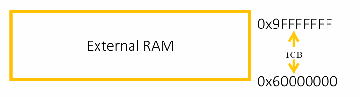
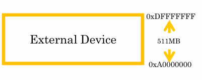
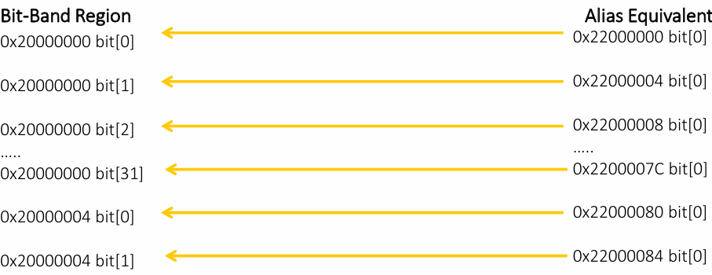

# Arm Cortex M3/M4

## I. Operational mode of the processor
Đối với ARM core Mx có 2 lại chế độ hoạt động: Thread mode(User Mode) và Handler mode

- vi sử lí luôn bắt đầu ở chế độ Thread mode:

- chế độ handler mode chỉ được kích hoạt khi xuất hiện Exception/interrupt event:


## II. Access level of the processor
- ARM cortex có 2 cấp truy cập PAL(Privileged Access Levels) và NPAL(Non-Privileged Access Levels)  
- Nếu code thực thi ở cấp truy cập PAL, vi sử lí có thể truy cập toàn bộ nguồn dự liệu và các thanh ghi
- Nếu code thực thi ở cấp truy cập NPAL, vi sử lí không thể truy cập một vài thanh ghi hạn chế

- PAL là cấp truy cập mắc định của vi sử lí
- Thread Mode có thể hoạt động ở 2 cấp truy cập PAL và NPAL. 


- chuyển từ PAL -> NPAL bằng cách  set bit nPRIV trong CONTROL register

- Khi set bit nPRIV không thể clear nPRIV(tức là ở chế độ thread mode khi đã lựa chọn NPAL không thể sửa lại được).khi cố tình sửa lại bit nPRIV hoặc truy cập vào các thanh ghi bị giới hạn sẽ sảy ra lỗi  hard fault 
- cách duy nhất có thể chuyển từ NPAL-> PAL là chuyển từ Thread mode sang Handler mode
- Handler Moden luôn luôn thực thi code tại PAL


## III. thanh ghi của Cortex Mx(32 bit)
- Các thanh ghi dùng chung bao gồm R0-R12
- Thanh ghi R13 là SP(Stack pointer) giữ địa chỉ của đầu Stack
- LR(link register) nhận địa chỉ trả về từ PC(Program Counter). Khi thoát khỏi hàm hoặc là các ngắt (interrupts/exception) thì PC -> LR
- PC(Program Counter) thanh ghi chứa địa chỉ của câu lệnh kế tiếp được thực thi
- Program Status Register

### 1. Program Status Register
T bit của EPSR
- Nhiều bộ xử lý ARM hỗ trợ sự tương tác ARM - Thumb. Tức là có thể chuyển đổi giữa 2 trạng thái ARM và Thumb
- Bộ xử lý phải ở trạng Thái ARM để thực thi các lệnh từ ARM ISA
- Bộ xử lý phải ở trạng Thái Thumb để thực thi các lệnh từ Thumb ISA
- Nếu T bit (EPSR) được set(1), bộ vi xử lý sẽ thực thi lệnh từ Thumb ISA
- Nếu T bit (EPSR) được reset(0), bộ vi xử lý sẽ thực thi lệnh từ ARM ISA
- Đối với bộ xử lý ARM Cortex Mx không hỗ trợ trạng thái ARM -> T bit luôn được đặt ở giá trị 1 . Khi T bit = 0 -> sảy ra Usage fault exception
- lsb(bit 0) của PC được liên kết với T bit. Khi load địa chỉ vào PC thì bit cuối cùng được nạp vào T bit -> 0th bit của địa chỉ luôn luôn là 1
-> đó là lý do tại sao toàn bộ địa chỉ vector được tăng lên 1 trong vector table 


## IV. ARM gcc inline assembly code
- Inline assembly code được sử dụng để viết code assembly trong ngôn ngữ C


## V. các bước Reset của bộ xử lý ARM
- Khi vi xử lý reset, PC load giá trị 0x0000_0000
- Processor đọc giá trị địa chỉ tại địa chỉ 0x0000_0000 vào MSP(main stack pointer register) PC nhảy đến địa chỉ tếp theo(0x0000_0004) -> processor khởi tạo giá trị của stack pointer
- sau khi Processor đọc giá trị tại 0x0000_0004 vào PC giá trị đại chỉ của reset Handler
- PC nhảy đến reset handler 
- trong Reset handler được viết bởi hàm C hoặc Assembly để tiến hành và khởi tạo các thứ cần thiết
- cuối cùng set gọi hàm main()


## VI. Memory Map and Bus interfaces
### 1. Memory Map of the processor

- Bản đồ bộ nhớ giải thích cách ánh xạ các thanh ghi ngoại vi và bộ nhớ khác nhau trong phạm vi vị trí bộ nhớ có thể định địa chỉ của bộ xử lý
- Bộ xử lý, phạm vi vị trí bộ nhớ có thể định địa chỉ, phụ thuộc vào kích thước của bus địa chỉ.
- Việc ánh xạ các vùng khác nhau trong phạm vi vị trí bộ nhớ có thể định địa chỉ được gọi là "memory map"

- CODE Region

\- Đây là vùng mà MCU nhà cung cấp nên kết nối bộ nhớ CODE.
\- Các loại bộ nhớ Code khác nhau là: Flash nhúng, ROM, OTP, EEPROM,v.v.
\- Theo mặc định, bộ xử lý sẽ lấy thông tin bảng vectơ từ vùng này ngay sau khi đặt lại

- SRAM Region

Vùng SRAM (Static-RAM) nằm trong 512 MB tiếp theo của không gian bộ nhớ sau vùng CODE.
\- Nó chủ yếu dùng để kết nối SRAM, chủ yếu là SRAM trên chip.
\- 1 MB đầu tiên của vùng SRAM là bit có thể định địa chỉ.
\- Bạn cũng có thể thực thi mã chương trình từ vùng này

- Peripherals Region

\- Vùng bộ nhớ ngoại vi cũng có kích thước là 512MB,
\- Được sử dụng chủ yếu cho các thiết bị ngoại vi trên chip.
\- Giống như vùng SRAM, 1MB đầu tiên của vùng ngoại vi có thể được địa chỉ hóa bit nếu tính năng bit-band tùy chọn được bao gồm.
\- Đây là vùng eXecute Never (XN)
\- Cố gắng thực thi mã từ vùng này sẽ kích hoạt ngoại lệ lỗi

- External RAM Region

\- Vùng này dành cho bộ nhớ trên chip hoặc ngoài chip. Có thể thực thi mã trong vùng này.

- External Device Region

\- Vùng này dành cho các thiết bị bên ngoài và/hoặc bộ nhớ dùng chung
\- Đây là vùng eXecute Never (XN)

- Private Peripheral Bus Region

\- Vùng này bao gồm NVIC, Bộ đếm thời gian hệ thống và khối điều khiển hệ thống
\- Đây là vùng eXecute Never (XN)

### 2. Bus Protocols and Bus interfaces
- Trong bộ xử lý Cortex Mx, giao diện bus dựa trên thông số kỹ thuật kiến trúc bus vi điều khiển (AMBA) tiên tiến
- AMBA là thông số kỹ thuật do ARM thiết kế, quản lý tiêu chuẩn cho giao tiếp trên chip bên trong hệ thống trên chip
- Thông số kỹ thuật AMBA hỗ trợ một số giao thức bus.
\- AHB Lite (AMBA High-performance Bus)
\-APB (AMBA Peripheral Bus)
- AHB and APB
\- Bus AHB Lite chủ yếu được sử dụng cho các giao diện bus chính
\- Bus APB được sử dụng để truy cập PPB và một số truy cập ngoại vi trên chip sử dụng cầu nối AHB-APB
\- Bus AHB Lite chủ yếu được sử dụng cho giao tiếp tốc độ cao với các thiết bị ngoại vi đòi hỏi tốc độ hoạt động cao.
\- Bus APB được sử dụng cho giao tiếp tốc độ thấp so với AHB.Hầu hết các thiết bị ngoại vi không yêu cầu tốc độ hoạt động cao đều được kết nối với bus này.


### 3. Bit band and bit band alias addresses
#### giới thiệu chung
- Bit-banding là một kỹ thuật ánh xạ bộ nhớ cho phép thao tác trực tiếp và hiệu quả các bit riêng lẻ trong bộ vi điều khiển và hệ thống nhúng. 
- Nó cung cấp một cơ chế để truy cập và sửa đổi các bit cụ thể trong bộ nhớ thông qua các địa chỉ bí danh duy nhất.

- các vùng dành cho SRAM và thiết bị ngoại vi bao gồm các vùng bit-band tùy chọn.
- ``note`` Tính năng này là tùy chọn. tức là, nhà sản xuất MCU hỗ trợ nó hoặc nhiều nhà sản xuất không hỗ trợ tính năng này. Tham khảo hướng dẫn tham khảo
``` C
Alias_address = alias_base +( 32 * (bit_band_memory_addr - bit_band_base ) ) + bit * 4
/*
  Alias_address
  Alias_base
  Bit_band_memory_addr
  Bit_band_base
  Bit
*/
```



## VII. Stack memory 
### 1. Giới thiệu
- Stack memory là một phần của bộ nhớ chính ( RAM nội và ngoại) được dành riêng cho việc lưu chữ dữ liệu tạm thời
- sử dụng chín trong hàm, xử lý ngắt và ngoại lệ
- stack memory được truy cập theo kểu LIFO(last in first out). Có thể truy cập khi sử dụng PUSH và POP và được sử dụng bất kỳ hướng dẫn thao tác bộ nhớ nào LD, STR
- Stack được theo dõi bằng thanh ghi SP. lệnh PUSH và POP ảnh hưởng đến thanh ghi SP (tăng hoặc giảm)
### 2. Ứng dụng của Stack memory
- lưu trữ tạm thời các giá trị thanh ghi bộ xử lý
- lưu trữ gias trị cụ bộ của hàm
- trong việc xử lý ngoại lệ và ngắt, Stack memory sẽ được dùng để giữ nội dung(các giá thị thanh ghi dùng trung, trạng thái của thanh ghi, giá trị trả về) của các mã đang thực thi
### 3. Kiến trúc bộ nhớ RAM

\- Global data section: Sẽ được sử dụng khi chương trình chứa dữ liệu toàn cục và các biến cục bộ tĩnh. Thậm chí bạn có thể lưu trữ các hướng dẫn ở đây và thực hiện nó
\- Heap section: Sẽ được sử dụng trong quá trình phân bổ bộ nhớ động.
\- Stack section: Sẽ được sử dụng trong quá trình gọi hàm để lưu dữ liệu tạm thời, lưu trữ tạm thời các biến cục bộ của hàm, lưu trữ tạm thời các khung ngăn xếp trong quá trình ngắt và ngoại lệ.

## Mô hình hoạt động ngăn xếp
- Full Ascending stack (FA)
- Full Descending stack(FD) (ARM Cortex Mx processors use this)
- Empty Ascending stack(EA) 
- Empty Descending stack(ED)


Full Descending stack(FD)
	Các đặc điểm của FD
-SP bắt đầu giữ một giá trị địa chỉ
- Khi thực hiện lệnh PUSH thì giá trị địa chỉ của SP giảm , địa chỉ SP sẽ giữ giá trị đã được PUSH lên
- khi thực hiện lênh POP thì giá trị của SP sẽ tăng  

EX : thực hiện các lệnh
	

## Stack placement
### 1. Stack placement type
- có 2 loại phân bố Vị trí ngăn xếp(stack) trong ứng dụng. Điều này phụ thuộc vào cấu hình trong linker file

### 2. Stack pointer
- Về mặt vật lý, có 2 thanh ghi con trỏ ngăn xếp trong bộ xử lý Cortex-M
\- Con trỏ ngăn xếp chính (MSP): Đây là con trỏ ngăn xếp mặc định được sử dụngsau khi đặt lại và được sử dụng cho tất cả các trình xử lý ngoại lệ/ngắt và cho
các mã chạy ở chế độ luồng
\- Con trỏ ngăn xếp quy trình (PSP): Đây là con trỏ ngăn xếp thay thế chỉ có thể được sử dụng ở chế độ luồng. Nó thường được sử dụng cho tác vụ ứng dụng trong các hệ thống nhúng và hệ điều hành nhúng
- Sau khi bật nguồn, bộ xử lý tự động khởi tạo MSP bằng cách đọc vị trí đầu tiên của bảng vectơ.

### 3. Stack activities during interrupt and exception
- Để cho phép sử dụng hàm 'C' như trình xử lý ngoại lệ/ngắt, cơ chế ngoại lệ cần tự động lưu R0 vào R3, R12, LR và XPSR khi nhập ngoại lệ và khôi phục chúng khi thoát ngoại lệ dưới sự kiểm soát của phần cứng bộ xử lý.
- Theo cách này, khi quay lại chương trình bị ngắt, tất cả các thanh ghi sẽ có cùng giá trị như khi chuỗi nhập ngắt bắt đầu.
## System exception control registers
### 1. ARM Cortex-M3/M4 processor peripherals


- System Control Block
\- Khối điều khiển hệ thống (SCB) cung cấp thông tin triển khai hệ thống và điều khiển hệ thống. Điều này bao gồm cấu hình, điều khiển và báo cáo các ngoại lệ của hệ thống.

## Exception Entry/Exit Sequence

### 1.  Exception Entry Sequence 
- Bộ bit đang chờ
- Xếp chồng và Lấy vector.
- Việc nhập vào trình xử lý và bộ bit đang hoạt động sẽ xóa trạng thái đang chờ (bộ xử lý tự động thực hiện)
- Bây giờ chế độ bộ xử lý đã thay đổi thành chế độ trình xử lý.
- Bây giờ mã trình xử lý đang được thực thi.
- MSP sẽ được sử dụng cho bất kỳ hoạt động ngăn xếp nào bên trong trình xử lý.
### 2. Exception Exit sequence 
- Trong bộ xử lý Cortex-M3/M4, cơ chế trả về ngoại lệ được kích hoạt bằng cách sử dụng địa chỉ trả về đặc biệt được gọi là EXC_RETURN.
- EXC_RETURN được tạo ra trong quá trình nhập ngoại lệ và được lưu trữ trong LR.
- Khi EXC_RETURN được ghi vào PC, nó sẽ kích hoạt ngoại lệ trả về

### 3. EXC_RETURN 
- Trong quá trình nhập trình xử lý ngoại lệ, giá trị của địa chỉ trả về (PC) không được lưu trữ trong LR như khi gọi một hàm C bình thường. Thay vào đó, cơ chế ngoại lệ lưu trữ giá trị đặc biệt được gọi là EXC_RETURN trong LR.


## ARM cortex M3/M4 fault handlers
- Lỗi là một ngoại lệ được tạo ra bởi bộ xử lý (ngoại lệ hệ thống) để chỉ ra lỗi

- ``note``
\- Hard fault exception
\- Usage fault exception 
\- Mem manage fault exception
\- Bus fault  exception 

## Exceptions for system-level services
### 1. Giới thiệu
- Bộ xử lý ARM Cortex Mx hỗ trợ 2 ngoại lệ dịch vụ cấp hệ thống quan trọng. SVC (SuperVisor Call) và PendSV (Pendable SerVice)
- Các cuộc gọi giám sát thường được sử dụng để yêu cầu các hoạt động đặc quyền hoặc quyền truy cập vào tài nguyên hệ thống từ hệ điều hành
- Ngoại lệ SVC chủ yếu được sử dụng trong môi trường hệ điều hành. Ví dụ, tác vụ người dùng ít đặc quyền hơn có thể kích hoạt ngoại lệ SVC để lấy các dịch vụ cấp hệ thống (như truy cập trình điều khiển thiết bị, thiết bị ngoại vi) từ hạt nhân của HĐH
- PendSV chủ yếu được sử dụng trong môi trường HĐH để thực hiện chuyển đổi ngữ cảnh giữa 2 hoặc nhiều tác vụ khi không có ngoại lệ nào khác đang hoạt động trong hệ thống

### 2. SVC (Supervisor Call)
- SVC là lệnh ISA ngón tay cái gây ra ngoại lệ SVC
- Trong kịch bản RTOS, tác vụ người dùng có thể thực thi lệnh SVC với đối số liên quan để thực hiện các cuộc gọi giám sát nhằm tìm kiếm tài nguyên đặc quyền từ mã hạt nhân
- Tác vụ người dùng không có đặc quyền sử dụng lệnh SVC để thay đổi chế độ bộ xử lý sang chế độ đặc quyền để truy cập tài nguyên đặc quyền như thiết bị ngoại vi
- Lệnh SVC luôn được sử dụng cùng với một số, có thể được sử dụng để xác định loại yêu cầu theo mã hạt nhân
- Trình xử lý SVC thực thi ngay sau lệnh SVC (không có độ trễ. Trừ khi có ngoại lệ có mức độ ưu tiên cao hơn xuất hiện cùng lúc)

#### Các phương pháp để kích hoạt ngoại lệ SVC

- Thực thi trực tiếp lệnh SVC với giá trị tức thời: SVC #i (i = 0-255)
- Thiết lập bit ngoại lệ đang chờ xử lý trong "System Handler Control and State Register" (không phổ biến)

Cách trích xuất số SVC
- Lệnh SVC có một số được nhúng bên trong, thường được gọi là số SVC
- Trong trình xử lý SVC, bạn nên lấy mã lệnh của lệnh SVC rồi trích xuất số SVC
- để lấy mã lệnh của lệnh SVC từ bộ nhớ chương trình, chúng ta nên có giá trị của PC (địa chỉ trả về) tại đó mã người dùng đã ngắt trong khi kích hoạt ngoại lệ SVC
- Giá trị của Pc (địa chỉ trả về) tại đó mã người dùng đã ngắt được lưu trữ trong
ngăn xếp như một phần của trình tự nhập ngoại lệ của bộ xử lý

### 3. PendSV Exception
- Đây là loại ngoại lệ 14 và có mức độ ưu tiên có thể lập trình
- Ngoại lệ này được kích hoạt bằng cách đặt trạng thái đang chờ xử lý của nó bằng cách ghi vào "Interrupt Control and State Register" của bộ xử lý
- Kích hoạt ngoại lệ hệ thống pendSV là một cách để gọi hạt nhân ưu tiên để thực hiện chuyển đổi ngữ cảnh trong Môi trường hệ điều hành
- Trong môi trường hệ điều hành, trình xử lý PendSV được đặt ở mức ưu tiên thấp nhất và trình xử lý PendSV sẽ thực hiện thao tác chuyển đổi ngữ cảnh

#### Cách sử dụng PendSV thông thường
- Thông thường, ngoại lệ này được kích hoạt bên trong trình xử lý ngoại lệ có mức ưu tiên cao hơn và được thực thi khi trình xử lý có mức ưu tiên cao hơn hoàn tất
- Sử dụng đặc điểm này, chúng ta có thể lên lịch trình thực thi trình xử lý ngoại lệ PendSV sau khi tất cả các thao tác xử lý ngắt khác hoàn tất
- Điều này rất hữu ích cho thao tác chuyển đổi ngữ cảnh, đây là thao tác quan trọng trong nhiều thiết kế hệ điều hành
- Sử dụng PendSV trong chuyển đổi ngữ cảnh sẽ hiệu quả hơn trong môi trường nhiễu ngắt
- Trong môi trườnSg nhiễu ngắt và chúng ta cần trì hoãn việc chuyển đổi ngữ cảnh cho đến khi tất cả IRQ được thực thi

#### Các trường hợp sử dụng PendSV khác
- Gỡ tải xử lý ngắt
- Nếu trình xử lý có mức ưu tiên cao hơn đang thực hiện công việc tốn thời gian, thì các ngắt có mức ưu tiên thấp hơn khác sẽ bị ảnh hưởng và khả năng phản hồi của hệ thống có thể giảm. Có thể giải quyết vấn đề này bằng cách kết hợp ISR và trình xử lý pendSV

#### Xóa tải xử lý ngắt bằng PendSV
Ngắt có thể được phục vụ trong 2 nửa
1 Nửa đầu là phần quan trọng về thời gian cần được thực thi như một phần của ISR
2 Nửa thứ hai được gọi là nửa dưới, về cơ bản là thực thi bị trì hoãn, trong đó phần còn lại của công việc tốn thời gian sẽ được thực hiện
do đó, PendSV có thể được sử dụng trong những trường hợp này, để xử lý thực thi nửa thứ hai bằng cách kích hoạt nó trong nửa đầu


